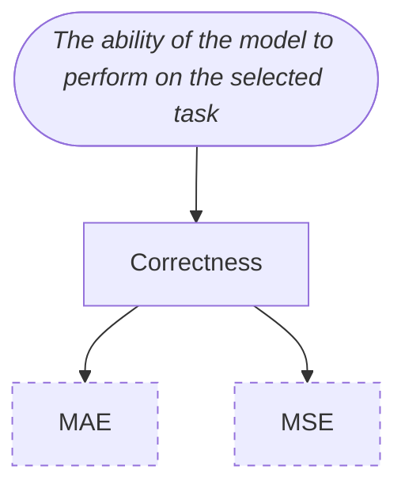

```mermaid
graph TD;
    A([The ability of the model to perform on the selected task]):::goal
    B[Correctness]

    M1[MAE]:::metric
    M2[MSE]:::metric


    A --> B --> M1 & M2


    classDef metric stroke-dasharray: 5 5 
    classDef goal font-style: italic
```